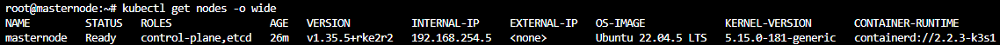

This document validates that the RKE2 cluster is fully operational after installation or changes. It confirms that the control plane, worker nodes, and system components are healthy and ready for workloads.

`kubectl get nodes -o wide`

